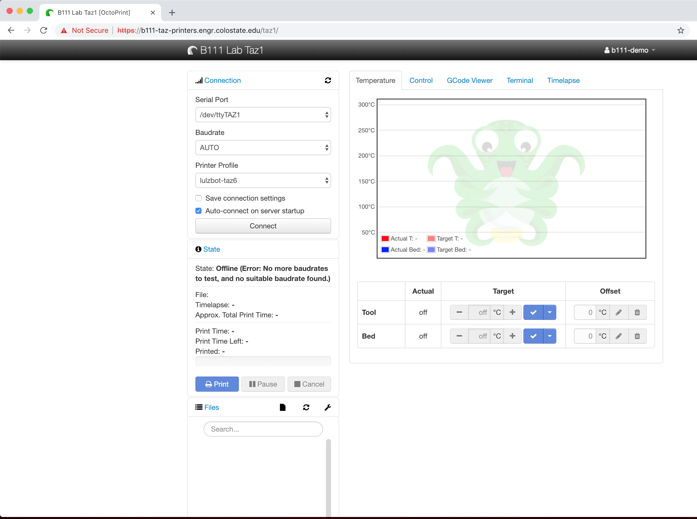
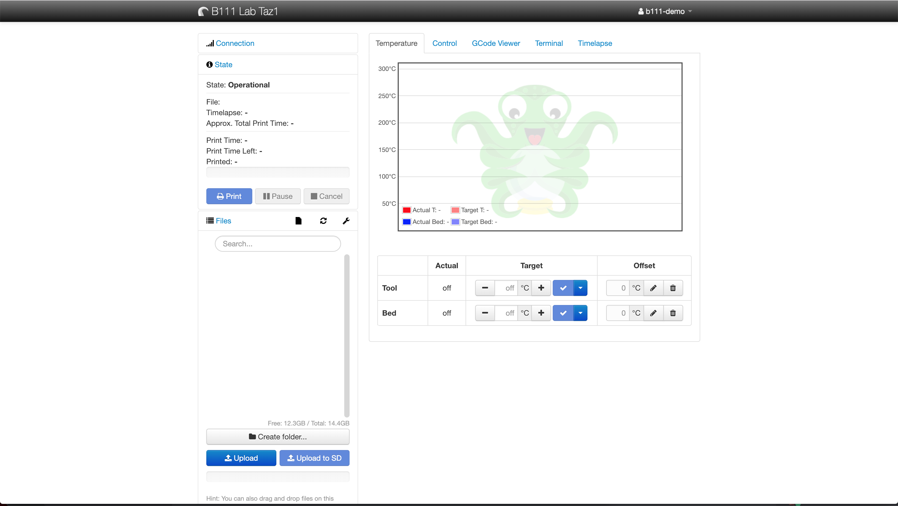

# 3D printing Quickstart Guide

## Overall Steps to 3D print

1.  3D printer training.
2.  Decide what you want to print and what material to use.
3.  Design your part in 3D modeling software
4.  Use CURA to slice your part into layers and produce GCODE.
5.  Import GCODE into OctoPrint and print your part.

## 3D printer training

Either come to one of the 3D printer training sessions listed on the website
and emailed to you, or email eceb111lab@gmail.com in order to arrange a
different time. If you do not do this, you will not be allowed to 3D print. See
the policies page for further details.

You are required to come to our training session even though you may have prior
3D printing experience. This is to ensure everyone has a baseline amount of
experience with our particular printers and their quirks. **No exceptions will
be made to this policy**. Attending this training is also how you get your
OctoPrint account.

Once you have passed the 3D printing training, an account on the Octoprint
servers will be created for your team. This will enable you to connect to the
printers and print. Please keep this information safe as we don’t want to be
constantly resetting passwords. If anything is done to the printers with your
account, your team will be held responsible, even if it was not actually any of
your team members.

Buy your own filament and start printing. If you have any questions, feel free
to ask the lab team. See the quickstart guide for a refresher if you can’t
remember all the required steps.

## Modeling your part

This topic is very large and is not a subject for this quickstart guide. A few
3D printing specific notes are shown below.

-   Filament selection:

<table>

<tr>
  <th>Filament</th>
  <th>Bed Temperature</th>
  <th>Filament Temperature</th>
  <th>Description</th>
</tr>

<tr>

  <td>PLA</td>

  <td>65&deg;C</td>

  <td>200&deg;C</td>

  <td>PLA (Polylactic Acid) is a good inexpensive filament for prototypes. It is
  reasonably strong but very easy to print with and get good results. It has
  poor heat tolerance and will deform, even in the back of a hot car. It is
  biodegradable so is more environmentally friendly.</td>

  </tr>

<tr>

  <td>ABS</td>

  <td>110&deg;C</td>

  <td>240&deg;C</td>

  <td>ABS (Acrylonitrile Butadiene Styrene) is harder to print with, but is
  probably the strongest out of the common filaments. It is also fairly brittle.
  Larger parts have a tendency to warp and lose dimensional accuracy if the part
  cools down too quickly. Always use the printer enclosures if printing with
  ABS. ABS can be dissolved with Acetone, which allows parts to be smoothed, as
  well as plastic welded. It is UV sensitive and will deteriorate over time if
  exposed to the sun. It is non biodegradable but is recyclable.</td>

</tr>

<tr>

  <td>HIPS</td>

  <td>100&deg;C</td>

  <td>240&deg;C</td>

  <td>HIPS (High Impact Polystyrene) is slightly easier to print with than ABS
  and does not warp as much. It has similar strength to ABS but is less brittle.
  Larger parts have a tendency to warp and lose dimensional accuracy if the part
  cools down too quickly. Always use the printer enclosures if printing with
  HIPS. HIPS can be dissolved with Limonene similarly to ABS.</td>

</tr>

<tr>

  <td>Nylon</td>

  <td>65&deg;C</td>

  <td>230&deg;C</td>

  <td>Nylon (Polyamide) is very hard wearing and is ideal for parts that rub or
  wear such as gears. It will absorb moisture during storage</td>

</tr>

</table>

There are other specialty filaments such as wood tone, conductive, flexible,
etc. If you have unique requirements, ask one of the B111 team members or look
around on the internet.

## Slicing with CURA

1.  Export your object as a `STL` file from your 3D modeling software.

2.  Make sure to set up CURA for the appropriate 3D printer, either the Lulzbot Mini or the Lulzbot TAZ 6. You will probably need to do this
when you first use CURA on a computer. If you are not prompted to set up a new
printer, then you should be fine. Configuration examples for our printers are
shown below. After you click `add printer`, you will not need to change anything
on the next dialog page and can just click `finish`.

If you only need to print on one type of printer, then just add the one you
need. Otherwise be sure to go to `Settings -> Printer -> Add Printer` and add
the other type of printer.

If you need to switch machine types, you can select from the `Settings ->
Printer` dropdown in CURA.

3.  Import your file into CURA Lulzbot Edition, which is on all the B111 lab computers. Cura can also be downloaded onto personal computers
as well from <https://www.lulzbot.com/cura#download>. This documentation was
produced with Cura Lulzbot Edition V3.2.32.
    1.  Click on `File -> New Project` to clear the workspace. You can
    also hit `ctrl + N`.
    2.  Click on the folder on the left side to import your STL file. You can import
    multiple STL files at once if you want. You can also go to `File -> Open File`
    or `Ctrl + O` to add files.

4.  On the right hand side, select your filament material and profile from the
drop down menus. The standard profile works well for most parts. If you are
having issues with small details, you could try the high quality profile. **Be
aware:** This will significantly increase your print time. The high speed
profile can decrease your print time if you do not have detailed parts.

5.  Select your infill, support and build plate adhesion settings.
    -   A 20% to 40% infill is good enough for most projects.
    -   The support options allow for larger overhangs and holes to be printed.
    -   The build plate adhesion setting usually can be set to skirt.
        -   Skirt: Prints an outline of filament around your part to prime the
        extruder and show if the bed is level.
        -   Brim: If you have small parts or are having issues with your part
        detaching from the print bed, then you may want to try a brim. This
        prints a single layer of filament around your part that is attached to
        your part in order to increase the surface area of your part on the
        build plate.
        -   Raft: If you are still having issues with your part coming off, you
        can try a raft. This prints a large extra thick brim under and
        around your part. This can be tricky to remove from your part and
        uses extra filament so it is not recommended except in certain
        cases. Please talk to the B111 lab team before resorting to a skirt,
        as we may be able to provide alternate solutions.
    -   If you understand 3D printing well and need to tweak specific settings,
    you can do so under the custom tab. **NOTE:** Do not change the
    `default nozzle size` setting. You may have to change the
    `print temperature` and `build plate temperature` under the `materials`
    section if things are not printing quite right. If you have questions,
    please ask the B111 Labs team first.

6.  Position your part on the build platform and choose the scale and rotation of your part. You must click on the part you want to change in order to activeate the controls on the left. Use your best judgement about the best way to locate and orient your part on the build platform. These controls are found on the left of the screen. Some tips:
    -   There either needs to be a flat side on your part, or supports must be on,
    at least from part to build platform.
    -   3D printed parts are often strongest in the horizontal (XY plane), with
    the vertical axis weaker due to the layering effect.
    -   Circles and holes print much more accurately if printed with their center axis vertical.

7.  Once you are satisfied with how your part looks in CURA, export your part to
GCODE. This will contain every instruction to control the 3D printer, from the
temperature information to the axis zeroing and cleaning instructions. Cura will
Automatically slice your file whenever you make changes, so as long as the text
in the bottom right says save to file, everything should be good and you can go
ahead and save your GCODE file by hitting save to file.

## Octoprint

1.  Log in to OctoPrint. Each printer has its own website as listed below or on
the ECE Student Projects Lab Website.
<http://projects-web.engr.colostate.edu/ece-sr-design/B111Lab/>
    -   **Mini 1:** <https://b111-mini-printers.engr.colostate.edu/mini1/>
    -   **Mini 2:**<https://b111-mini-printers.engr.colostate.edu/mini2/>
    -   **Taz 1:**<https://b111-taz-printers.engr.colostate.edu/taz1/>
    -   **Taz 2:**<https://b111-taz-printers.engr.colostate.edu/taz2/>

2.  Verify OctoPrint can talk to the printer. Usually this is not the case
since we keep the printers turned off. If you see a screen that looks like the
picture below, click the connect button on the right side, after verifying that
the serial port and profile are correct and the printer has been turned on.
The settings should match the printer type and number of the printer you
selected. It will take a minute to automatically connect back up to the
printer, but when connected, the screen should look like the second image.

### Octoprint Communications Failure

### Octoprint Communications Success

3.  Import your part into Octoprint.
    1.  Click Upload and select the gcode file you created in CURA.
    2.  If you are uploading several parts, create a folder for your parts.
    3.  When you are done, please delete your part files since there is limited
    space on the OctoPrint servers.
4.  Select your part in the list and load it. Make sure it shows up properly
in the preview window.
5.  Select the control tab and preheat the extruder to 250ºC to allow ABS to flow.
6.  Feed cleaning filament through the printing head until it comes out clear.
You can either manually push the cleaning filament through the extruder, or
lock the filament into the auto feeder and then use the move axis command in
Octoprint to extrude the filament. Please do not be stingy with the
cleaning filament.
7.  Adjust the extruder temperature to the appropriate temperature for your
chosen filament. See the table above or the signs by the 3D printers.
8.  Insert your filament into the extruder and lock it down and position your
filament reel on the holder.
9.  Using the controls in Octoprint, extrude filament until you see it change
color from the clear of the cleaning filament.
10. Remove any excess extruded plastic from around the extruder or bed and then press print in Octoprint. The printer will automatically come up to temperature and start printing. Feel free to monitor the print job anywhere on campus, or while connected to the VPN from off campus.
11. When your print is done, you will have 24 hours to come and remove it from
the printer. If you do not, your filament and print will be locked away, and
your account will be disabled on octoprint. If you have further infractions, you may loose your 3D printing privileges.

See the policies page on the B111 Lab website for refreshing your knowledge of
the removal and printer usage policies which you covered during your mandatory
printer training.
